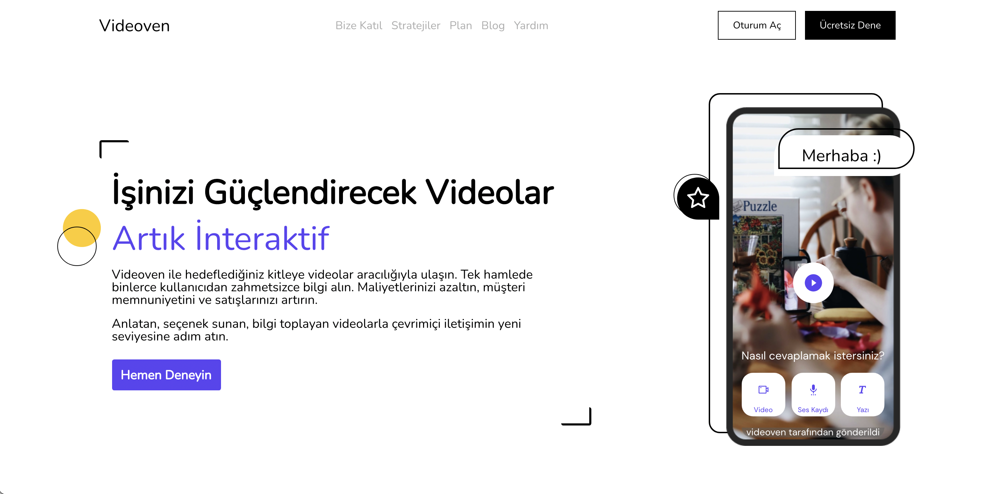

This project was bootstrapped with [Create React App](https://github.com/facebook/create-react-app).

You can view a live demo over at https://videoven-project.vercel.app/

<br />
<div align="center">
    <p>Videoven</p>
    <br/>
    
</div>
<br />
<br />

## Getting Started

### Prerequisites

- [Node.js](https://nodejs.org/en/download/)
- [yarn](https://yarnpkg.com/) or npm

### Installation

Clone the repo

```sh
git clone https://github.com/haguse/videoven-project.git
```

<br/>

Install packages

`yarn` or `npm install`

<br/>

Start

`yarn start` or `npm start`
<br/>

#### Built with
* [ReactJS](https://reactjs.org/)
* [styled-components](https://styled-components.com/)
